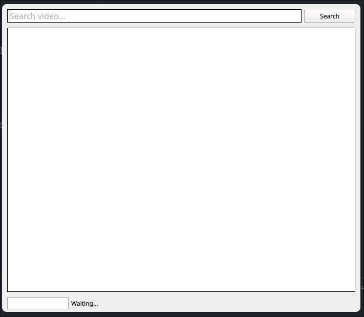

Sometimes my mother asks me to download music from YouTube[^1].

While I know how do to it using `yt-dlp` from the terminal (I even have my fish abbreviations for that) the thing is I needed an excuse to learn how
to create a PyQt app from zero so here we are.

## Requirements

On top of `requirements.txt` you also need `yt-dlp` and all it's dependencies installed on your machine.

## Running it 

For now you just `python main.py` while I figure out how to package it properly.

[^1]: TOS who?